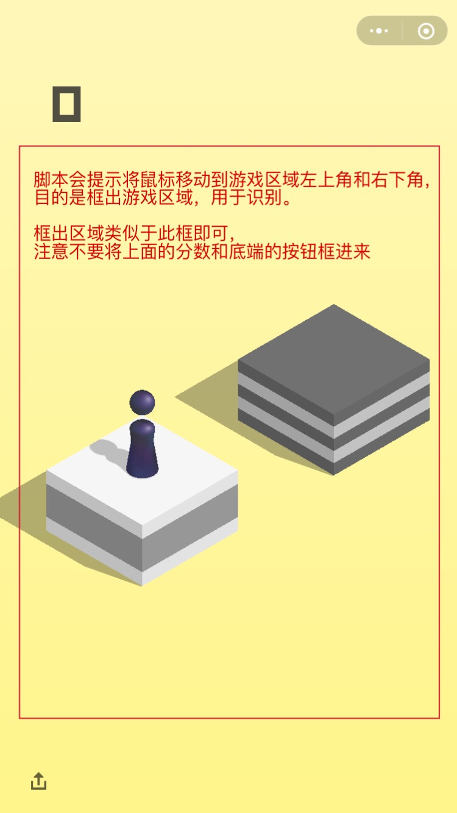

# PlayJumpGame
微信跳一跳小游戏脚本

## 工具

1. Windows PC
2. 安卓模拟器 for Windows（新版本微信的跳一跳需要Android 5.0及以上，大多数模拟器都是Android 4.4.4的，笔者找到一款，叫雷电模拟器，支持Android 5.0）
3. Python 3.6
4. [pywin32](https://sourceforge.net/projects/pywin32/files/pywin32/)（python的windows扩展，用于windows截屏）
5. [Pillow](http://pillow.readthedocs.io/en/latest/installation.html)（图片处理库，用于分析图像）

## 用法

1. 安装Python 3，pywin32，Pillow和安卓模拟器。

2. 在模拟器中运行最新版微信（6.6.1及以上），打开跳一跳，开一局，进入到准备起跳的界面

3. 运行脚本play_jump_game.py

4. 按提示移动鼠标，框出游戏区域：
   

5. 脚本开始自动玩游戏

## 特点

1. 支持商店和音乐盒的识别，可以停下来加分。
2. 能处理转弯（由向右跳变为向左跳或反之）带来的误差，几乎可以做到无限刷分（虽然当前版本已屏蔽过高分值）。
3. 精确落地（落到每个方块的正中心获得额外加分）的准确度达到70%～80%。
4. 新版本跳一跳会检测每次点击的位置，以屏蔽机器操作。此脚本中加入了随机量来模拟人工点击来应对这一点

## 效果

此图仅作参考，新版本跳一跳已屏蔽过高分数，虽然可以刷到10000多，但无法上传到排行榜上。